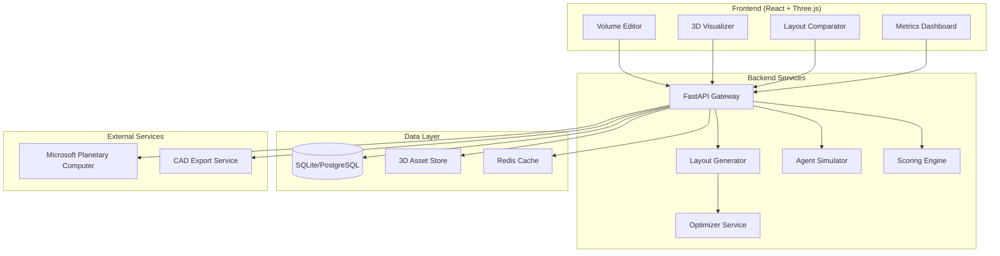

# Design Document

## Overview

HabitatCanvas is architected as a modern web application with a React frontend and Python FastAPI backend, designed for real-time 3D habitat layout generation and optimization. The system employs a microservices approach for scalability, with specialized services for optimization, simulation, and systems analysis.

The core innovation lies in coupling geometry-aware generative design with real-time systems proxies and human workflow simulation, enabling rapid iteration on habitat layouts while maintaining engineering fidelity.

## Architecture

### High-Level System Architecture



### Technology Stack

**Frontend:**
- React 18 with TypeScript for type safety
- React Three Fiber (R3F) for 3D rendering
- Three.js for WebGL graphics and geometry operations
- Zustand for state management
- TailwindCSS for styling
- Vite for build tooling

**Backend:**
- Python 3.11+ with FastAPI for high-performance async API
- Pydantic for data validation and serialization
- SQLAlchemy for database ORM
- Redis for caching and session management
- Celery for background task processing

**Optimization & Simulation:**
- pymoo for NSGA-II multi-objective optimization
- Mesa for agent-based simulation
- NetworkX for graph analysis and pathfinding
- NumPy/SciPy for numerical computations

**3D & Geometry:**
- trimesh for collision detection and geometric operations
- Open3D for advanced 3D processing
- GLTF/GLB for 3D asset pipeline

## Components and Interfaces

### Frontend Components

#### Volume Builder Component
```typescript
interface VolumeBuilderProps {
  onVolumeChange: (envelope: EnvelopeSpec) => void;
  initialVolume?: EnvelopeSpec;
}

interface EnvelopeSpec {
  id: string;
  type: 'cylinder' | 'torus' | 'box' | 'freeform';
  params: Record<string, number>;
  coordinateFrame: 'local' | 'global';
  metadata: {
    name: string;
    creator: string;
    created: Date;
  };
}
```

**Responsibilities:**
- Parametric primitive creation (cylinder, torus, box)
- Freeform spline-based sculpting interface
- Real-time 3D preview with dimension feedback
- Export/import envelope specifications

#### Layout Visualizer Component
```typescript
interface LayoutVisualizerProps {
  layout: LayoutSpec;
  envelope: EnvelopeSpec;
  viewMode: 'inspect' | 'edit' | 'compare';
  onLayoutChange?: (layout: LayoutSpec) => void;
}

interface LayoutSpec {
  layoutId: string;
  envelopeId: string;
  modules: ModulePlacement[];
  kpis: PerformanceMetrics;
  explainability: string;
}
```

**Responsibilities:**
- Interactive 3D layout rendering
- Module drag-and-drop editing
- Heatmap overlay visualization
- Camera controls and navigation

#### Metrics Dashboard Component
```typescript
interface MetricsDashboardProps {
  layouts: LayoutSpec[];
  comparisonMode: boolean;
  onMetricFilter: (metric: string, threshold: number) => void;
}

interface PerformanceMetrics {
  meanTransitTime: number;
  egressTime: number;
  massTotal: number;
  powerBudget: number;
  thermalMargin: number;
  lssMargin: number;
  stowageUtilization: number;
}
```

**Responsibilities:**
- KPI visualization and comparison
- Pareto front plotting
- Metric filtering and sorting
- Delta change indicators

### Backend Services

#### Layout Generator Service
```python
class LayoutGenerator:
    def __init__(self, module_library: ModuleLibrary, constraint_checker: ConstraintChecker):
        self.module_library = module_library
        self.constraint_checker = constraint_checker
        self.optimizer = NSGAIIOptimizer()
    
    async def generate_layouts(
        self, 
        envelope: EnvelopeSpec, 
        mission_params: MissionParameters
    ) -> List[LayoutSpec]:
        """Generate multiple candidate layouts using multi-objective optimization"""
        pass
```

**Responsibilities:**
- Multi-objective genetic algorithm optimization
- Constraint satisfaction (collision, connectivity, clearances)
- Layout grammar enforcement (adjacency rules)
- Pareto front generation

#### Scoring Engine Service
```python
class ScoringEngine:
    def __init__(self):
        self.lss_model = LSSModel()
        self.thermal_model = ThermalModel()
        self.power_model = PowerModel()
        self.human_factors = HumanFactorsAnalyzer()
    
    async def score_layout(self, layout: LayoutSpec) -> PerformanceMetrics:
        """Compute comprehensive performance metrics for a layout"""
        pass
```

**Responsibilities:**
- Life Support Systems (LSS) mass balance calculations
- Thermal budget analysis (steady-state approximation)
- Power consumption and battery sizing
- Human factors metrics (transit time, accessibility)

#### Agent Simulation Service
```python
class AgentSimulator:
    def __init__(self):
        self.model = CrewWorkflowModel()
    
    async def simulate_crew_workflow(
        self, 
        layout: LayoutSpec, 
        mission_params: MissionParameters
    ) -> SimulationResults:
        """Run agent-based simulation of crew daily activities"""
        pass
```

**Responsibilities:**
- Discrete event simulation of crew activities
- Emergency evacuation scenario modeling
- Congestion and bottleneck analysis
- Heatmap generation for traffic patterns

## Data Models

### Core Data Structures

```python
from pydantic import BaseModel
from typing import List, Dict, Optional
from enum import Enum

class ModuleType(str, Enum):
    SLEEP_QUARTER = "sleep_quarter"
    GALLEY = "galley"
    LABORATORY = "laboratory"
    AIRLOCK = "airlock"
    MECHANICAL = "mechanical"
    MEDICAL = "medical"
    EXERCISE = "exercise"
    STORAGE = "storage"

class ModuleSpec(BaseModel):
    module_id: str
    type: ModuleType
    bbox_m: Dict[str, float]  # x, y, z dimensions
    mass_kg: float
    power_w: float
    stowage_m3: float
    connectivity_ports: List[str]
    adjacency_preferences: List[ModuleType]
    adjacency_restrictions: List[ModuleType]

class ModulePlacement(BaseModel):
    module_id: str
    type: ModuleType
    position: List[float]  # [x, y, z]
    rotation_deg: float
    connections: List[str]  # connected module IDs

class MissionParameters(BaseModel):
    crew_size: int
    duration_days: int
    priority_weights: Dict[str, float]  # safety, efficiency, mass, etc.
    activity_schedule: Dict[str, float]  # time allocation per activity type
    emergency_scenarios: List[str]
```

### Database Schema

```sql
-- Envelopes table
CREATE TABLE envelopes (
    id UUID PRIMARY KEY,
    name VARCHAR(255) NOT NULL,
    type VARCHAR(50) NOT NULL,
    params JSONB NOT NULL,
    metadata JSONB,
    created_at TIMESTAMP DEFAULT NOW(),
    updated_at TIMESTAMP DEFAULT NOW()
);

-- Layouts table
CREATE TABLE layouts (
    id UUID PRIMARY KEY,
    envelope_id UUID REFERENCES envelopes(id),
    name VARCHAR(255),
    modules JSONB NOT NULL,
    kpis JSONB NOT NULL,
    explainability TEXT,
    generation_params JSONB,
    created_at TIMESTAMP DEFAULT NOW()
);

-- Simulation results table
CREATE TABLE simulation_results (
    id UUID PRIMARY KEY,
    layout_id UUID REFERENCES layouts(id),
    simulation_type VARCHAR(50) NOT NULL,
    results JSONB NOT NULL,
    created_at TIMESTAMP DEFAULT NOW()
);
```

## Error Handling

### Frontend Error Boundaries
- React Error Boundaries for component-level error isolation
- Toast notifications for user-facing errors
- Graceful degradation for 3D rendering failures
- Offline mode detection and caching

### Backend Error Handling
```python
from fastapi import HTTPException
from enum import Enum

class ErrorCode(str, Enum):
    CONSTRAINT_VIOLATION = "CONSTRAINT_VIOLATION"
    OPTIMIZATION_FAILED = "OPTIMIZATION_FAILED"
    INVALID_ENVELOPE = "INVALID_ENVELOPE"
    SIMULATION_ERROR = "SIMULATION_ERROR"

class HabitatCanvasException(Exception):
    def __init__(self, code: ErrorCode, message: str, details: Dict = None):
        self.code = code
        self.message = message
        self.details = details or {}

# Global exception handler
@app.exception_handler(HabitatCanvasException)
async def habitat_canvas_exception_handler(request, exc):
    return JSONResponse(
        status_code=400,
        content={
            "error_code": exc.code,
            "message": exc.message,
            "details": exc.details
        }
    )
```

### Constraint Validation
- Real-time collision detection using spatial indexing
- Connectivity graph validation with NetworkX
- Clearance checking with configurable tolerances
- Mass and power budget validation

## Testing Strategy

### Unit Testing
```python
# Example test structure
class TestLayoutGenerator:
    def test_generate_layouts_basic_cylinder(self):
        """Test layout generation for simple cylindrical habitat"""
        envelope = create_test_cylinder(radius=3.0, length=12.0)
        mission = create_test_mission(crew_size=4, duration_days=180)
        
        layouts = self.generator.generate_layouts(envelope, mission)
        
        assert len(layouts) >= 3
        assert all(self.constraint_checker.validate(layout) for layout in layouts)
    
    def test_constraint_violation_handling(self):
        """Test proper handling of impossible constraint combinations"""
        envelope = create_test_cylinder(radius=1.0, length=2.0)  # Too small
        mission = create_test_mission(crew_size=6, duration_days=365)  # Too many crew
        
        with pytest.raises(HabitatCanvasException) as exc_info:
            self.generator.generate_layouts(envelope, mission)
        
        assert exc_info.value.code == ErrorCode.CONSTRAINT_VIOLATION
```

### Integration Testing
- End-to-end API testing with pytest and httpx
- 3D rendering tests using headless browser automation
- Performance benchmarking for optimization algorithms
- Database migration and data integrity tests

### User Acceptance Testing
```typescript
// Example Cypress test
describe('Layout Generation Workflow', () => {
  it('should generate layouts from cylinder habitat', () => {
    cy.visit('/');
    cy.get('[data-testid="volume-builder"]').should('be.visible');
    
    // Create cylinder habitat
    cy.get('[data-testid="shape-cylinder"]').click();
    cy.get('[data-testid="radius-input"]').type('3.0');
    cy.get('[data-testid="length-input"]').type('12.0');
    
    // Set mission parameters
    cy.get('[data-testid="crew-size"]').type('4');
    cy.get('[data-testid="duration"]').type('180');
    
    // Generate layouts
    cy.get('[data-testid="generate-button"]').click();
    cy.get('[data-testid="layout-thumbnails"]').should('have.length.gte', 3);
    
    // Verify metrics are displayed
    cy.get('[data-testid="metrics-panel"]').should('contain', 'Transit Time');
    cy.get('[data-testid="metrics-panel"]').should('contain', 'Egress Time');
  });
});
```

### Performance Testing
- Load testing for concurrent layout generation requests
- Memory usage profiling for large habitat models
- 3D rendering performance across different devices
- Optimization algorithm convergence testing

## Microsoft Planetary Computer Integration

### Site Analysis Pipeline
```python
class SiteAnalyzer:
    def __init__(self):
        self.stac_client = Client.open("https://planetarycomputer.microsoft.com/api/stac/v1")
    
    async def analyze_earth_analog_site(
        self, 
        bbox: List[float], 
        date_range: str
    ) -> SiteAnalysisResults:
        """Analyze Earth analog site using MPC data"""
        
        # Search for relevant datasets
        search = self.stac_client.search(
            collections=["sentinel-2-l2a", "cop-dem-glo-30"],
            bbox=bbox,
            datetime=date_range
        )
        
        items = list(search.get_items())
        
        # Process elevation data for slope analysis
        dem_analysis = await self._process_elevation_data(items)
        
        # Compute solar illumination patterns
        solar_analysis = await self._compute_solar_patterns(bbox, date_range)
        
        # Analyze surface characteristics
        surface_analysis = await self._analyze_surface_properties(items)
        
        return SiteAnalysisResults(
            slope_map=dem_analysis.slope_map,
            solar_hours=solar_analysis.daily_hours,
            surface_roughness=surface_analysis.roughness_index,
            accessibility_score=self._compute_accessibility(dem_analysis, surface_analysis)
        )
```

### Integration Points
- Site selection interface for Earth analog testing
- Environmental context for thermal modeling
- Logistics analysis for habitat deployment
- Illumination window computation for power systems

## Deployment Architecture

### Development Environment
```yaml
# docker-compose.yml
version: '3.8'
services:
  frontend:
    build: ./frontend
    ports:
      - "3000:3000"
    environment:
      - REACT_APP_API_URL=http://localhost:8000
  
  backend:
    build: ./backend
    ports:
      - "8000:8000"
    environment:
      - DATABASE_URL=postgresql://user:pass@db:5432/habitatcanvas
      - REDIS_URL=redis://redis:6379
    depends_on:
      - db
      - redis
  
  db:
    image: postgres:15
    environment:
      - POSTGRES_DB=habitatcanvas
      - POSTGRES_USER=user
      - POSTGRES_PASSWORD=pass
    volumes:
      - postgres_data:/var/lib/postgresql/data
  
  redis:
    image: redis:7-alpine
    ports:
      - "6379:6379"

volumes:
  postgres_data:
```

### Production Deployment
- Frontend: Vercel or Netlify for static hosting with CDN
- Backend: Google Cloud Run or AWS ECS for containerized services
- Database: Managed PostgreSQL (Cloud SQL, RDS)
- Cache: Managed Redis (Cloud Memorystore, ElastiCache)
- Assets: Cloud Storage (GCS, S3) for 3D models and exports
- Monitoring: Sentry for error tracking, DataDog for performance monitoring

### Scaling Considerations
- Horizontal scaling of optimization workers using Celery
- Database read replicas for analytics queries
- CDN for 3D asset delivery
- Load balancing for API gateway
- Auto-scaling based on CPU and memory metrics